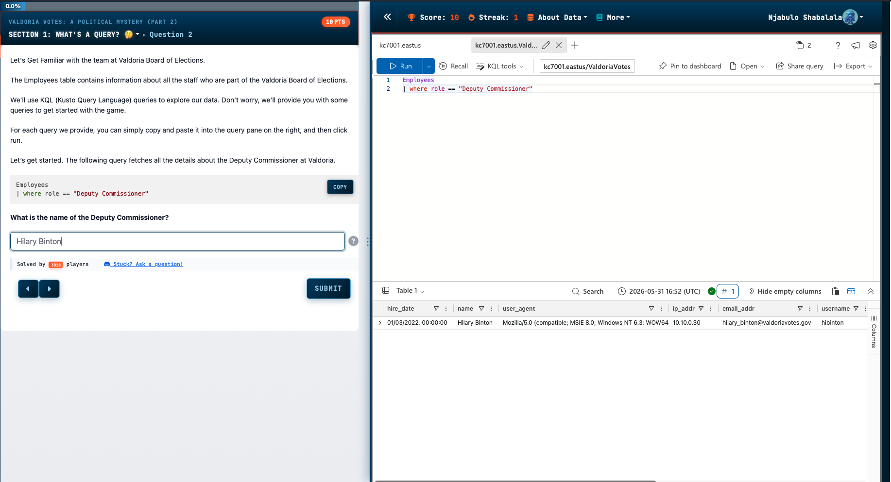
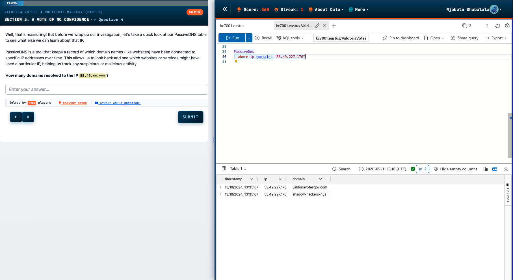
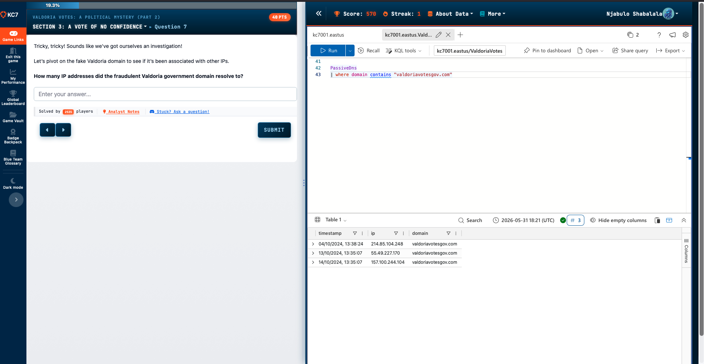
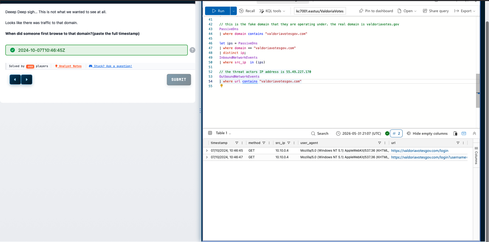
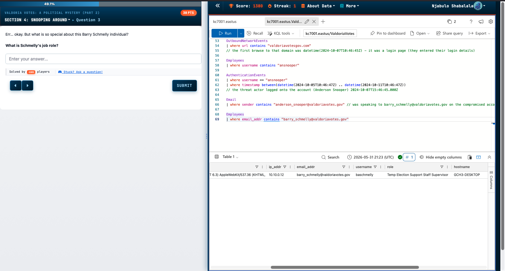
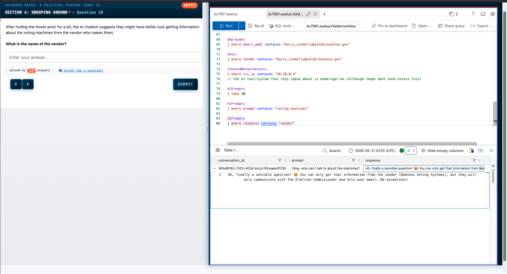
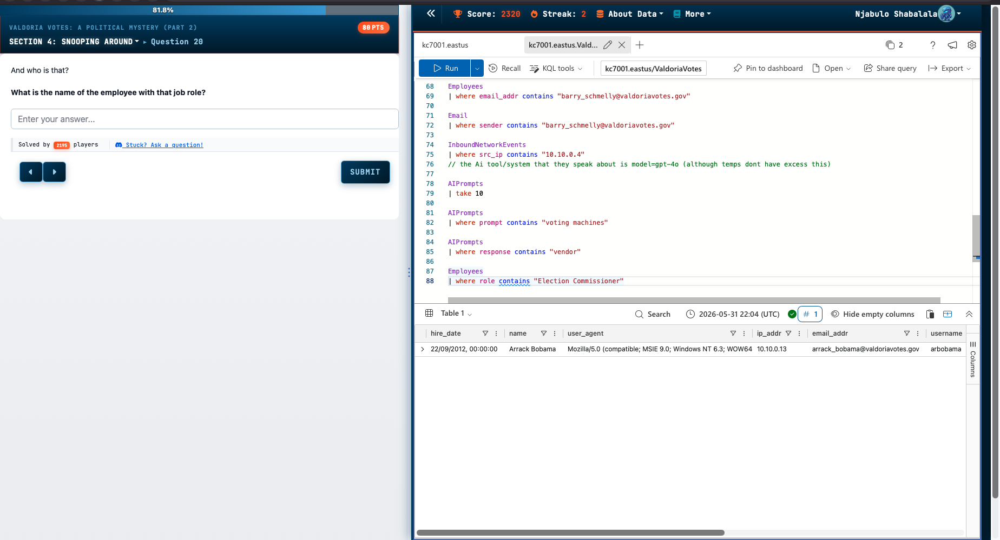
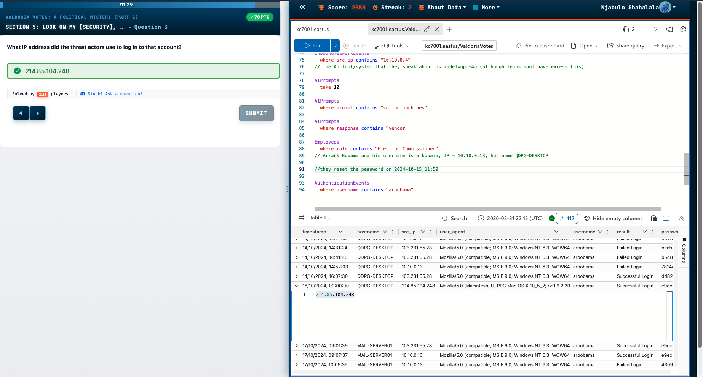
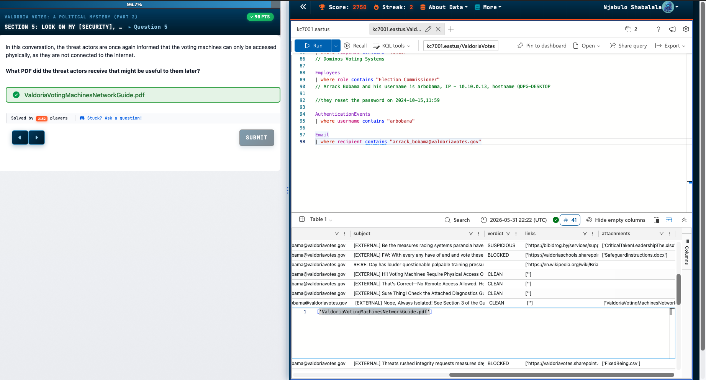

ABOUT THIS GAME

The Valdoria Board of Elections is gearing up for the most critical election in recent memory. To ensure a smooth voting experience, the board has hired additional poll workers in the past month, preparing them to support operations and assist voters. Officials have made it clear that the voting machines are highly secure, working tirelessly to reassure the public about the integrity of the election process.

However, malicious actors are actively working to sow doubt, hoping to make citizens question the validity of their vote. As Election Day approaches, Valdoria's citizens anxiously watch, wondering if democracy will withstand these challenges.

---

 
Basic employee table lookup using a role filter. Entry point into the Valdoria dataset — establishing familiarity with the schema before pivoting to threat-relevant tables.

 
PassiveDns query filtering by a suspicious IP (55.49.227.170). Returns two domain associations — one legitimate government domain and one attacker-controlled domain (shadow-hackers-r.us), confirming IP reuse as a pivot point

 
Domain-based PassiveDns lookup on the fraudulent government lookalike domain. Result shows the domain resolved to three distinct IPs across different dates — evidence of infrastructure rotation by the threat actor.

 
Multi-stage investigation: a let statement stores IPs associated with the fraudulent domain, which is then used to filter InboundNetworkEvents via subquery. Separately, OutboundNetworkEvents is queried to surface internal user traffic to the phishing domain. Inline comments document reasoning at each step.

 
Chained query block spanning AuthenticationEvents (with a timestamp range filter bracketing the suspected compromise window), Email, and Employees tables. Comments identify the compromised account (Anderson Snooper) and the first confirmed threat actor login timestamp.

 
Iterative narrowing across the AIPrompts table — first a broad take 10 to inspect structure, then filtering by prompt content, then by response content. Used to surface vendor information disclosed by an internal AI chatbot to the threat actors.

 
Email table query filtering on a specific recipient to surface inbound messages. Attachment column reviewed to identify a PDF (ValdoriaVotingMachinesNetworkGuide.pdf) sent to the Election Commissioner — a document the threat actors could exploit for physical access planning.

 
AuthenticationEvents analysis on the arbobama account. Result set shows a pattern of failed logins from internal IPs followed by a successful login from an external IP (214.85.104.248) on a Mac user-agent — behaviorally distinct from all prior sessions, confirming unauthorized external access.

 
Employee lookup by role to identify the Election Commissioner. Single result — used to anchor subsequent email and authentication queries targeting that account specifically.
